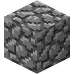

# BLUWWY 

Bluwwy is a simple (and somewhat slow) Python tool I developed in an hour and a half to apply Gaussian blur to images.

## USAGE
py bluwwy.py <image.png> <size (3,5,7,9)> <output.png>

The larger the size, the bigger the gaussian kernel is, the blurrier it becomes. 
(if you want something blurrier, just modify the code, it's very simple, but you might want to look up a sigma value that fits your new kernel size, because eyeballing it won't do the trick)

### EXAMPLE

```py bluwwy.py input.png 9 output.png```
input.png: /n
/n
output.png:/n
/n

## EXPLANATION

This algorithm is widely used in commercial software such as Photoshop or GIMP. I thought it would be fun to release it because it's very straightforward, and checking out the code is quite interesting, though please note that the comments are in Spanish! :/
I won't be updating this; I'm publishing it as-is for anyone interested. I hope someone finds it useful someday. Be sure to star the repo if you do!
For any questions, message me on discord at **@nanasuuakiaa**; I'll answer much quicker there than here.

Thanks!! GL
